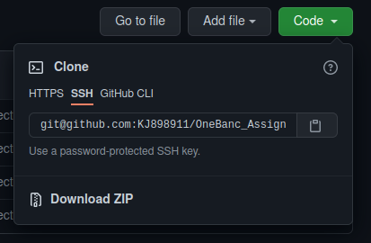
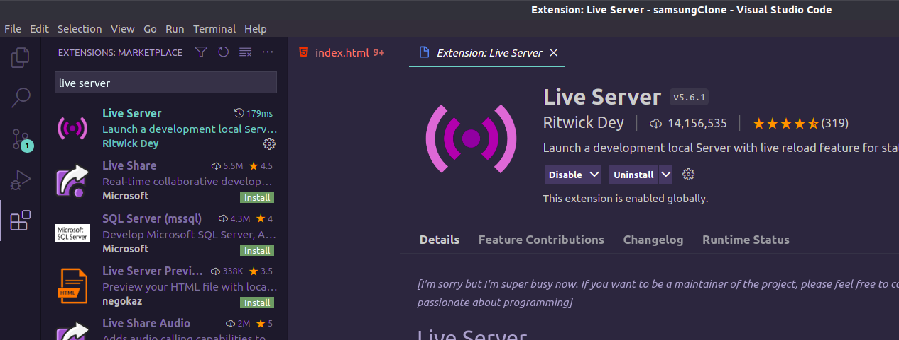
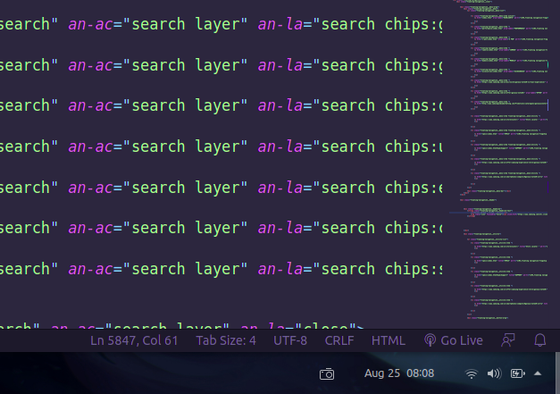
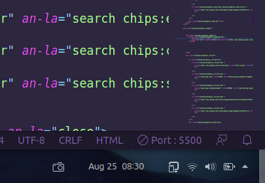

# OneBanc_Assignment
Samsung Note 20 clone made for Assessment purposes:-

Please Follow these Instructions to carefully run the project with all the animations:-

Step 1: Please download the project by selecting Code button and then downloading the zip file. Please keep all the files in the same folder.

Step 2: After you have downloaded the project please ensure you have VS Code downloaded and installed.

Step 3: On VS Code install "LIVE SERVER" extension 

Step 4: After Live server has been successfully installed. Open the "index.html" file in the project folder using "VS Code".
       "index.html" can be found in the project here => www.samsung.com / in / smartphones / galaxy-note20 / index.html (NOTE:- These are project folder names)
 

Step 5: After you have opened index.html in VS code click "Go live" button in the botton right corner of the VS code window.

Step 6: The "Go Live" button will now show the port no. and by default it will automatically host index.html and automatically open the website in the default browser.

Step 7: If the website does not open by default the link will be of the following format:-
        http://127.0.0.1:Port_Number/www.samsung.com/in/smartphones/galaxy-note20/index.html (here it is 5500)
